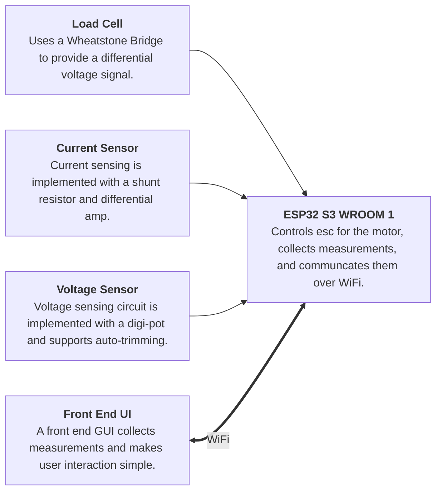

# DTTS V2

This repo houses the hardware design and associated documentation for the SUAS Dynamic Thrust Test Stand(DTTS) V2.
The new board is designed to be more intuitive to use and more robust against failures like over voltage, shorts, etc.
The V2 board also integrates all sensors and ICs in a single solution.

## System Diagram

## Working Specs
- Battery Voltage $\leq$ 50 V.
- Max ESC Current $\leq$ 90 A.
- Using 6 AWG wire for battery.
- Must at minimum measure battery voltage, batter to ESC current, and Motor Thrust
- All circuitry must run off of a single battery -- the one plugged into the ESC
- Preferable to have auto-trimming and gain calibration on voltage sense circuity.

## Component Selection (Draft!)

1. [Toshiba CUS10S30 Schottkey Diodes](https://toshiba.semicon-storage.com/info/CUS10S30_datasheet_en_20140407.pdf?did=14077&prodName=CUS10S30) for signal over-voltage protection.\
  a. [Rohm RB520CM-60 Schottkey Diode](https://fscdn.rohm.com/en/products/databook/datasheet/discrete/diode/schottky_barrier/rb520cm-60t2r-e.pdf) Alternative to (1) with higher reverse voltage
