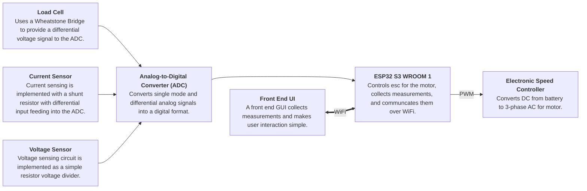

# DTTS V2

This repo houses the hardware design and associated documentation for the SUAS Dynamic Thrust Test Stand(DTTS) V2.
The new board is designed to be more intuitive to use and more robust against failures like over voltage, shorts, etc.
The V2 board also integrates all sensors and ICs in a single solution.

## System Diagram

## Working Specs
- Battery Voltage $\leq$ 50 V.
- Max ESC Current $\leq$ 90 A.
- Using 6 AWG wire for battery.
- Must at minimum measure battery voltage, batter to ESC current, and Motor Thrust
- All circuitry must run off of a single battery -- the one plugged into the ESC
- Preferable to have auto-trimming and gain calibration on voltage sense circuity.

## Component Selection (Draft!)

### Power Supply
There are some different approaches to this. If we were using a seperate battery for this, then we could have just used a linear regulator, but if we want to use the motor battery, this voltage may range from 12 to 60 V. So we probably need to use a buck converter. We could also use a hybrid design (i.e. 12-60V input down to 4.5V with a buck converter and 4.5V to 3.3V with an LDO). This may complicate things a little, but it's a very good choice in terms of noise and is also fairly efficient.

1. ~~[Diodes Incorporated AP66200](https://www.diodes.com/assets/Datasheets/AP66200.pdf) Buck controller.~~
2. [TI LMR51625](https://www.ti.com/lit/ds/symlink/lmr51625.pdf?ts=1742888310253&ref_url=https%253A%252F%252Fwww.ti.com%252Fsitesearch%252Fen-us%252Fdocs%252Funiversalsearch.tsp%253FlangPref%253Den-US%2526nr%253D3%2526searchTerm%253DLMR51625XDDCR) Buck Controller (preferred).
  a. Also, if using TI ICs for power conversion, check out [Webench Designer](https://webench.ti.com/power-designer/)

**All regulated power rails must have a zener diode of appropriate voltage to pull lines down if they have too high of a voltage.**
We should run some simulations to ensure the zener diode is enough for protecting regulated lines if battery is shorted to them or if
we need to have something else. We may also want to consider adding a fuse to the power rail since the zener diode will short to ground
and pull a lot of current.

## Voltage Protection on Signal Pins
For signal pins, zener diodes may work, but there are options for more precise control like Schottkey diodes. These can also provide reverse polarity protection if configured correctly, so this is the solution we will use. Here are some options for diodes that may work. The Rohm diode has a lower forward drop, which is good for protecting against over-voltage, but it has a low reverse voltage rating which is worse for reverse-polarity protection. The opposite is true for the Toshiba diode. We may need to look for other diodes that have the adequate reverse voltage rating(60V) and a low drop(ideally $\leq$ 300mV).
1. [Toshiba CUS10S30 Schottkey Diodes](https://toshiba.semicon-storage.com/info/CUS10S30_datasheet_en_20140407.pdf?did=14077&prodName=CUS10S30) for signal over-voltage protection.\
  a. [Rohm RB520CM-60 Schottkey Diode](https://fscdn.rohm.com/en/products/databook/datasheet/discrete/diode/schottky_barrier/rb520cm-60t2r-e.pdf) Alternative to (1) with higher reverse voltage

### Analog to Digital Converter
This component converts analog voltages(i.e. voltages that are not strictly interpretted as a `0` or a `1`) into a digital format(i.e. `0`'s and `1`'s). This allows software on the esp32 to read and store analog voltages as numbers or percents and communicate these values over WiFi or another transport medium to the GUI for the user. Since we are using a load cell, this needs a sensative ADC, and hence we choose to use a 24-bit chip. These are some options worth considering:

1. [Microchip MCP3564R](https://ww1.microchip.com/downloads/aemDocuments/documents/APID/ProductDocuments/DataSheets/MCP3561_2_4R-Data-Sheet-DS200006391C.pdf) has four channels, meaning we can use this for all three sensors (battery voltage, battery current, and motor thrust).
